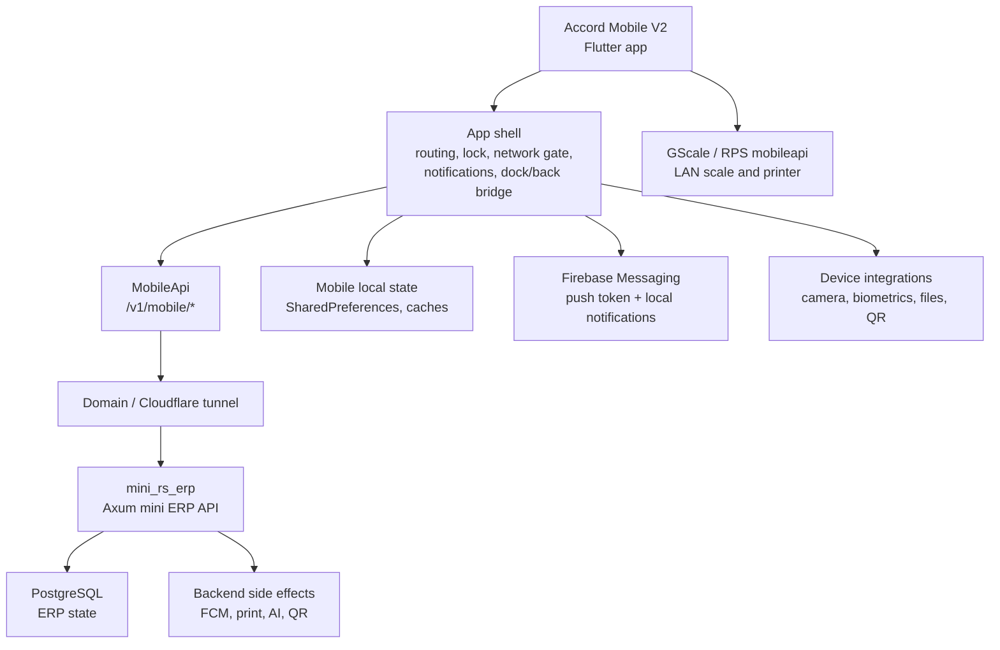

# Accord Mobile V2

`accord_mobile_v2` is the Flutter client for the Accord mini ERP ecosystem.
It is not a standalone business system. The app renders role-specific mobile
workspaces, keeps device/session/UI state, and calls `mini_rs_erp` through the
stable `/v1/mobile/*` HTTP contract.

The backend owns business truth: authentication, roles, production maps, WIP,
warehouse state, Qolip inventory, QR validation, customer/supplier workflow,
admin operations, printing side effects, push dispatch, and persistence. The
mobile app owns presentation, navigation, local device behavior, and API
orchestration.

## Current Scope

The app currently covers these mobile areas:

| Area | Responsibility |
| --- | --- |
| Auth and session | Phone/code login, token restore, automatic re-authentication, logout. |
| Role routing | Opens the correct workspace from backend role/capability data. |
| Supplier | Item selection, quantity entry, dispatch confirmation, history, notifications. |
| Werka | Warehouse/operator dashboard, pending/history/archive, confirmations, customer issue, unannounced receipt, QR lookup. |
| Customer | Delivery review, approve/reject flow, status details, notifications. |
| Admin | Users, roles, suppliers, customers, items, warehouses, production maps, WIP, monitoring, settings. |
| Aparatchi | Operator queue workspace for production-map work stages. |
| Qolipchi | Qolip/block/location inventory workspace. |
| Rezka | Cutting/split workflow entry point. |
| GScale/RPS | Embedded scale/print workflow and mobileapi integration. |
| Device runtime | Camera, QR scanner, biometric lock, push notifications, local files, theme, locale, preview mode. |

`werka` is still used in routes, capabilities, endpoints, labels, and local
keys as the compatibility name for the warehouse/operator flow. Do not rename it
casually: it is part of the mobile contract and persisted app state.

## Runtime Model



Default test backend:

```text
https://mini-rs-erp-dev.wspace.sbs
```

This domain is wired in both `Makefile` and `MobileApi.baseUrl`. A build should
not hardcode old domains or local-only URLs unless the run target explicitly
asks for local mode.

## Repository Boundary

This repository is responsible for:

- Flutter app startup and role routing.
- Mobile screens, shared components, theme, motion, navigation, and preview.
- Calling `mini_rs_erp` through `MobileApi`.
- Keeping local UI/session state in device storage.
- Registering Firebase push tokens and displaying local notifications.
- Camera, QR scan, file, biometric, iOS native back/dock, and Android runtime
  permission integration.
- Shared UI architecture so top bars, docks, drawers, fields, cards, dialogs,
  lists, and shells are reused instead of copy-pasted per role.

This repository is not responsible for:

- PostgreSQL schema or production ERP persistence.
- Production-map calculation truth.
- Queue validation truth.
- Qolip inventory truth.
- Stock movement truth.
- Role/capability truth.
- Push dispatch decisions.
- Print job business decisions.

Those belong to `mini_rs_erp`.

## Backend Dependency

`accord_mobile_v2` requires a reachable `mini_rs_erp` instance. Login and role
navigation depend on the backend. There is no production fallback that should
pretend ERP is working when the backend/database is unavailable.

The main app expects:

- `GET /healthz`
- endpoints under `/v1/mobile/auth/*`
- profile and push endpoints under `/v1/mobile/profile` and
  `/v1/mobile/push/token`
- Supplier endpoints under `/v1/mobile/supplier/*`
- Werka endpoints under `/v1/mobile/werka/*`
- Customer endpoints under `/v1/mobile/customer/*`
- Admin endpoints under `/v1/mobile/admin/*`
- Qolip endpoints under `/v1/mobile/qolip/*`
- Rezka endpoints under `/v1/mobile/rezka/*`
- GScale/RPS bridge endpoints used by `lib/src/core/api/gscale/`
- notification endpoints under `/v1/mobile/notifications/*`
- stock-entry and QR lookup endpoints used by warehouse/admin flows
- websocket endpoint for warehouse live updates

The app sends bearer tokens from `AppSession`. If a request returns `401`,
`MobileApi` tries to re-authenticate from stored phone/code credentials. If that
fails, the session is cleared and the user must log in again.

## Runtime Configuration

Main backend URL:

| Variable | Default | Used by |
| --- | --- | --- |
| `MOBILE_API_BASE_URL` | `https://mini-rs-erp-dev.wspace.sbs` | Main Accord mobile API. |
| `API_URL` | `https://mini-rs-erp-dev.wspace.sbs` | Makefile wrapper value passed into `MOBILE_API_BASE_URL`. |
| `LOCAL_API_URL` | `http://127.0.0.1:18081` | Local backend helper targets. |

GScale LAN/mobileapi URL:

| Variable | Default | Used by |
| --- | --- | --- |
| `API_BASE_URL` | `http://gscale.local:39117` | Embedded GScale runtime. |

Preview variables:

| Variable | Description |
| --- | --- |
| `APP_FORCE_DEVICE_PREVIEW` | Forces DevicePreview in debug mode. `make run` sets this by default. |
| `APP_PREVIEW_ROUTE` | Opens a specific route for focused UI preview. |
| `APP_PREVIEW_PHONE` | Phone used by preview login helpers. |
| `APP_PREVIEW_CODE` | Code used by preview login helpers. |
| `APP_PREVIEW_BATCH_DISPATCH_DEMO` | Enables direct batch dispatch preview mode when paired with a route. |

## Quick Start

Install Flutter dependencies:

```bash
make deps
```

Run against the current test domain in Chromium with DevicePreview:

```bash
make run
```

Run against a custom backend:

```bash
make run API_URL=https://mini-rs-erp-dev.wspace.sbs
```

Run against a local mini ERP backend:

```bash
make run-local
```

Run web explicitly:

```bash
make web
```

Run web against a local backend:

```bash
make web-local
```

Static analysis:

```bash
make analyze
```

Flutter tests:

```bash
make test
```

## Domain And Backend Startup Helpers

The mobile repo includes helper targets that delegate to runtime scripts and
the neighboring backend workspace. They are convenience wrappers, not the
source of backend truth.

Common backend/domain helpers:

| Target | Purpose |
| --- | --- |
| `make core-up` | Start required local core/runtime helpers. |
| `make core-stop` | Stop local core/runtime helpers. |
| `make remote-up` | Start a remote/tunnel runtime helper. |
| `make remote-stop` | Stop remote/tunnel runtime helper. |
| `make remote-url` | Print generated remote URL from `garbage/.core_tunnel_url`. |
| `make domain-up` | Start backend through the configured domain helper. |
| `make domain-up-fast` | Start domain helper without public healthcheck. |
| `make domain-url` | Print generated domain URL from `garbage/.core_domain_url`. |
| `make backend-up` | Start local mobile API helper when `API_URL` is local. |
| `make backend-stop` | Stop local mobile API helper. |

For the current shared test environment, the expected public API is:

```bash
curl https://mini-rs-erp-dev.wspace.sbs/healthz
```

Expected healthy response:

```json
{"ok":true}
```

If the domain is down, fix `mini_rs_erp` first. The mobile app cannot pass login
or ERP workflow smoke tests without it.

## Build Targets

Release APK through Makefile:

```bash
make apk API_URL=https://mini-rs-erp-dev.wspace.sbs APK_NAME=accord.apk
```

The Makefile release APK target builds arm64 only:

```make
--release --target-platform android-arm64
```

Debug arm64 APK, when a non-release test APK is needed:

```bash
flutter build apk --debug --target-platform android-arm64 \
  --dart-define=MOBILE_API_BASE_URL=https://mini-rs-erp-dev.wspace.sbs
```

Domain-backed release APK:

```bash
make apk-domain
```

Remote/tunnel-backed release APK:

```bash
make apk-remote
```

Android SDK bootstrap:

```bash
make android-sdk-setup
```

## Main Workflows

### Startup

Startup happens in `lib/main.dart`:

1. Flutter binding is initialized.
2. Edge-to-edge system UI is enabled.
3. Native back-button bridge is initialized.
4. Native dock bridge is initialized.
5. Local notifications are initialized.
6. Session is loaded.
7. Unread notification state is loaded.
8. Security, theme, locale, and platform helpers are loaded.
9. `ErpnextStockMobileApp` is rendered inside `DevicePreview` when preview is
   enabled.
10. Firebase push messaging is initialized outside web builds.

### App Shell

The app shell in `lib/src/app/app.dart` wraps every route with:

- `DockGestureOverlay`
- `NetworkRequirementRuntime`
- `NotificationRuntime`
- `AppLockGate`
- theme controller
- locale controller
- native back/dock navigation observers
- route capability checks

This means feature pages should not reimplement global lock, network,
notification, or native navigation behavior.

### Auth And Capability Flow

The backend returns profile, role, access role, and capability data. The app
uses that profile to decide which routes can be opened.

Role enum:

```dart
enum UserRole { supplier, werka, customer, aparatchi, qolipchi, admin }
```

Capability enforcement lives in `AppRouter.canOpenRoute` and
`_routeCapabilities`. Feature pages should not bypass that route gate. If a new
screen requires a permission, add the route capability there and keep the
backend capability contract in sync.

### Supplier Flow

Supplier screens handle:

- supplier dashboard and status summary
- item picker
- quantity entry
- confirm dispatch
- success/result page
- recent/history views
- notification views
- status breakdown and submitted-category details

Supplier pages should use shared navigation, shared cards, shared buttons, and
`MobileApi` supplier methods. They should not create their own HTTP clients.

### Werka Flow

Werka is the warehouse/operator workspace. It handles:

- dashboard and pending queues
- status breakdown and detail pages
- supplier receipt confirmation
- customer issue creation
- batch customer issue creation
- unannounced supplier creation
- stock-entry barcode lookup
- stock-entry QR scan
- archive by sent hub, day, month, year, period, and list
- Batch QR lookup and dispatch
- archive PDF/file save/share flows
- notifications

Important behavior:

- QR and stock-entry validation is backend-owned.
- Duplicate dispatch protection is backend-owned.
- Customer selection ordering is shared, not copied per screen.
- Archive/file flows may use local file APIs, but ERP truth remains in backend
  state.

### Customer Flow

Customer screens handle:

- delivery list and status summary
- delivery detail
- approve/reject response
- notifications
- shared notification detail

Customer priority and state helpers live under `lib/src/core/customer/` and the
customer feature state folder.

### Admin Flow

Admin screens handle:

- home/dashboard
- users and worker profiles
- roles and capabilities
- suppliers and customers
- supplier/customer item assignment
- inactive supplier restore/removal
- item and item group creation
- item group bulk move
- warehouses
- calculate and calculate orders
- production map test/editor
- production map live order queue
- WIP batches
- progress QR scan
- raw material rules and assignments
- apparatus settings, groups, and queue policies
- server monitor
- activity and notifications

Admin is the widest surface in the app. New admin functionality should be split
into focused state/model/helper files when it grows, but not fragmented so far
that the flow becomes harder to read.

### Aparatchi Flow

Aparatchi uses the production-map queue workspace for operator execution. Its
capabilities are centered around:

- viewing assigned apparatus queue
- starting/pause/resume/complete actions through backend-owned validation
- progress QR and material validation where required
- worker-mode route access

### Qolipchi Flow

Qolipchi screens are the mobile entry for Qolip inventory work:

- blocks
- locations
- cells
- QR-based inventory identity
- checkout/return/move actions through backend endpoints

The app should display the workflow and collect scans/actions. Inventory truth
belongs to `mini_rs_erp`.

### Rezka Flow

Rezka exposes split/cutting workflow screens behind the
`rezka.split.manage` capability. Quantity rules and final state changes must
stay backend-owned.

### GScale/RPS Flow

GScale mode is embedded in the app but has a separate LAN/mobileapi runtime.
It covers:

- LAN server discovery with `gscale.local` and approved ports
- health and handshake
- live monitor stream
- ERP setup status and setup submission/removal
- item and warehouse lookup
- batch start/stop
- manual print requests
- Zebra/Godex printer mode selection
- archive listing and archive print requests
- local draft persistence for operator settings

The main `mini_rs_erp` API is still used for related catalog/RPS bridge calls
where the code routes through `MobileApi`.

## Code Architecture

Top-level layout:

| Path | Purpose |
| --- | --- |
| `lib/main.dart` | Process startup and app bootstrap. |
| `lib/src/app/` | `MaterialApp`, router, route capability gate, page transitions. |
| `lib/src/core/api/` | API client facade and endpoint groups. |
| `lib/src/core/session/` | Session load/save, auth token, profile runtime. |
| `lib/src/core/security/` | PIN/biometric/app-lock runtime. |
| `lib/src/core/network/` | Network requirement gate. |
| `lib/src/core/notifications/` | Push, local notifications, unread/runtime stores. |
| `lib/src/core/realtime/` | Websocket/live clients. |
| `lib/src/core/search/` | Search normalization and activity state. |
| `lib/src/core/files/` | File save/share helpers. |
| `lib/src/core/localization/` | Uzbek, English, Russian localization runtime. |
| `lib/src/core/theme/` | Theme, typography, motion, visual tokens. |
| `lib/src/core/widgets/` | Shared app shell, cards, buttons, forms, lists, feedback, navigation widgets. |
| `lib/src/features/` | Role and feature-specific presentation/state/logic. |
| `test/` | Flutter widget/unit tests. |
| `docs/` | Runbooks and refactor plans. |
| `tools/` | Bootstrap/runtime helper scripts. |

Feature layout:

| Path | Purpose |
| --- | --- |
| `lib/src/features/auth/` | Login and app entry. |
| `lib/src/features/supplier/` | Supplier workspace. |
| `lib/src/features/werka/` | Warehouse/operator workspace. |
| `lib/src/features/customer/` | Customer workspace. |
| `lib/src/features/admin/` | Admin, production map, roles, warehouses, WIP, raw material, monitoring. |
| `lib/src/features/aparatchi/` | Operator-specific presentation entry points. |
| `lib/src/features/qolip/` | Qolipchi inventory workspace. |
| `lib/src/features/rezka/` | Rezka split workflow. |
| `lib/src/features/gscale/` | Embedded GScale/RPS runtime. |
| `lib/src/features/shared/` | Shared models and cross-role presentation. |

## Shared UI Rules

This app intentionally avoids copy-paste UI per role. Reusable pieces should
live in `lib/src/core/widgets/`, `lib/src/core/theme/`, or
`lib/src/features/shared/` when they are cross-role.

Use shared components for:

- top bars and native title styles
- bottom docks
- drawers
- profile shell
- cards and expandable cards
- form fields
- confirm dialogs
- loading/error/empty states
- list rows
- scroll physics
- route transition behavior

Do not create a new role-local copy of a component just to change text or a
small callback. Add parameters to the shared component instead. Role-local
widgets are acceptable when the workflow is genuinely unique.

## Navigation And Motion

Routes are centralized in `lib/src/app/app_router.dart`.

Current behavior:

- Most routes use `MaterialPageRoute`.
- Admin custom transition is disabled by `_usesAdminPageTransition`, which
  currently returns `false`.
- Static dock routes are listed in `AppRouter.staticDockRoutes`.
- Route access is capability-gated before building the page.

If a new transition is introduced, it should be intentional and shared. Do not
add one-off page slide effects that make back navigation feel inconsistent.

## Data And Local State

Local state is allowed for device/runtime concerns:

- auth token, last phone, and last code
- app profile and avatar cache
- unread/hidden notification state
- Supplier, Werka, and Customer runtime stores
- search activity and search normalization
- PIN, biometric, theme, and locale preferences
- cached GScale servers and operator-control drafts
- temporary files used for archive save/share flows

Local state is not the ERP source of truth. Any production action must go
through backend endpoints.

## Device Features

Android dependencies and permissions support:

- camera and QR scanning
- Firebase Cloud Messaging
- local notifications
- biometric unlock
- file save/share
- gallery access where needed
- legacy external storage support where required by older Android versions

iOS support includes:

- Face ID usage text
- camera usage text
- photo library usage text
- remote notification registration
- native scene integration for back navigation and bottom dock behavior
- signed profile build runbook for physical device installs

iOS physical device runbook:

```text
docs/runbooks/ios_device_install_runbook.md
```

## Testing

Run all Flutter tests:

```bash
make test
```

Run analyzer:

```bash
make analyze
```

Focused test coverage currently includes:

- app navigation and retry state
- route capability gates
- app shell native top-bar and bottom-nav behavior
- shared theme behavior
- supplier confirm flow
- customer delivery runtime and priority behavior
- Werka archive, QR, create hub, runtime store, and stock-entry lookup
- admin supplier/customer/item workflows
- admin roles, users, warehouses, WIP, server monitor, raw material screens
- production map models, chain, branch labels, stress paths
- GScale discovery/catalog/print helpers
- shared dialogs, async pickers, scroll physics
- search normalization and search activity persistence

Docs-only changes do not require a full Flutter test run, but code changes
should at minimum pass `make analyze` and the relevant focused tests.

## Operational Smoke Test

Before validating the mobile app, validate backend health:

```bash
curl https://mini-rs-erp-dev.wspace.sbs/healthz
```

Then run:

```bash
make run
```

Minimum manual smoke path:

1. Login with a valid test user.
2. Confirm the correct role workspace opens.
3. Open profile and return.
4. Open notifications.
5. For Supplier: select item, enter quantity, reach confirm page.
6. For Werka: open pending/history/archive and one QR/lookup screen.
7. For Customer: open a delivery detail.
8. For Admin: open roles, users, production map orders, WIP, server monitor.
9. Confirm navigation back behavior is normal.
10. Confirm no page uses an old backend domain.

## Troubleshooting

### `make: flutter: No such file or directory`

Flutter is not installed or not in `PATH`. The Makefile also checks:

```text
$HOME/.local/flutter/bin/flutter
```

Install Flutter or export the Flutter binary path before running Make targets.

### Linux build asks for `clang++`

That happens when running the Linux desktop target without the native build
toolchain. For normal preview, use the default Chromium target:

```bash
make run
```

If Linux desktop is required, install the C++ compiler/CMake GTK toolchain for
the host OS.

### Preview does not show phone frames

`make run` sets:

```text
APP_FORCE_DEVICE_PREVIEW=true
```

If running manually, pass it:

```bash
flutter run -d chrome \
  --dart-define=MOBILE_API_BASE_URL=https://mini-rs-erp-dev.wspace.sbs \
  --dart-define=APP_FORCE_DEVICE_PREVIEW=true
```

### Login does not work

Check in this order:

1. `mini_rs_erp` domain responds to `/healthz`.
2. Backend database is connected and not asleep.
3. The test user exists and has the expected role/capabilities.
4. The app was built with the expected `MOBILE_API_BASE_URL`.
5. Browser/device is not using a stale build with an old domain.

### CORS or web-only failures

`make run` uses Chromium flags that relax web security for local preview. Do
not treat those flags as production behavior. Production/mobile APKs must rely
on a real reachable HTTPS backend.

### APK points to the wrong backend

Rebuild with the explicit define:

```bash
flutter build apk --debug --target-platform android-arm64 \
  --dart-define=MOBILE_API_BASE_URL=https://mini-rs-erp-dev.wspace.sbs
```

or for Makefile release builds:

```bash
make apk API_URL=https://mini-rs-erp-dev.wspace.sbs
```

## Development Rules

- Keep backend truth in `mini_rs_erp`; keep this repo focused on mobile UX and
  device integration.
- Use `MobileApi.instance` and existing endpoint groups instead of creating
  ad-hoc HTTP clients in screens.
- Keep route names, role names, capability codes, and endpoint paths compatible
  with the backend.
- Do not hardcode old domains.
- Do not duplicate role UI when a shared component can be parameterized.
- Add or update tests when behavior changes.
- Keep `third_party/**` vendored code out of app-owned analyzer cleanup unless
  the vendored patch is intentional.
- Update this README when changing run commands, backend domain behavior,
  role/capability flow, or build artifacts.

## Related Repositories

| Repository | Relationship |
| --- | --- |
| `mini_rs_erp` | Primary backend and ERP source of truth for this app. |
| `accord_mobile_v2` | Flutter mobile client in this repository. |
| `gscale-zebra` | Optional LAN/mobileapi scale and printer runtime used by GScale mode. |
