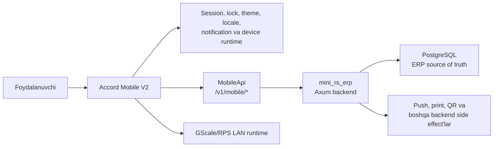
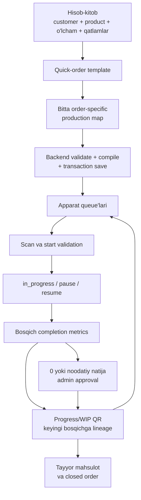

# Accord Mobile V2

`accord_mobile_v2` — Accord mini ERP uchun Flutter mobil klienti. Ilova
foydalanuvchining roli va capability'lariga mos ish maydonini ko'rsatadi,
qurilma bilan bog'liq holatlarni boshqaradi va barcha ERP amallarini
`mini_rs_erp` backendining `/v1/mobile/*` API contract'i orqali bajaradi.

> Muhim chegara: PostgreSQL va `mini_rs_erp` biznes haqiqatining yagona
> manbasi. Mobile UI, navigatsiya, scan, lokal preference va API
> orchestration'ni bajaradi; stock, queue, production map, Qolip va role
> qoidalarini mustaqil ravishda tasdiqlamaydi.

## Mundarija

- [Tizimdagi o'rni](#tizimdagi-orni)
- [Qo'llab-quvvatlanadigan rollar](#qollab-quvvatlanadigan-rollar)
- [Tez ishga tushirish](#tez-ishga-tushirish)
- [Konfiguratsiya](#konfiguratsiya)
- [Arxitektura](#arxitektura)
- [Production map modeli](#production-map-modeli)
- [Order lifecycle](#order-lifecycle)
- [Production execution qoidalari](#production-execution-qoidalari)
- [Asosiy ish oqimlari](#asosiy-ish-oqimlari)
- [Navigatsiya va umumiy UI](#navigatsiya-va-umumiy-ui)
- [Lokal holat va qurilma integratsiyalari](#lokal-holat-va-qurilma-integratsiyalari)
- [Build, test va tekshiruv](#build-test-va-tekshiruv)
- [Muammo yechish](#muammo-yechish)
- [Development qoidalari](#development-qoidalari)

## Tizimdagi o'rni


```mermaid
flowchart LR
    User["Foydalanuvchi"] --> Mobile["Accord Mobile V2"]
    Mobile --> Runtime["Session, lock, theme, locale,<br/>notification va device runtime"]
    Mobile --> Api["MobileApi<br/>/v1/mobile/*"]
    Api --> Domain["mini_rs_erp<br/>Axum backend"]
    Domain --> DB["PostgreSQL<br/>ERP source of truth"]
    Domain --> SideEffects["Push, print, QR va<br/>boshqa backend side effect'lar"]
    Mobile --> GScale["GScale/RPS LAN runtime"]
```

Mas'uliyatlar:

| Qism | Egasi |
| --- | --- |
| Auth token, profil va capability contract | `mini_rs_erp`, mobile'da session cache |
| Role bo'yicha ekran va route tanlash | Mobile |
| Production map validation va saqlash | `mini_rs_erp` |
| Queue holati va action ruxsati | `mini_rs_erp` |
| Stock, homashyo reservation va Qolip checkout | `mini_rs_erp` + PostgreSQL |
| Scan qilish va operator input'ini yig'ish | Mobile |
| WIP/progress lineage va yakuniy natija | `mini_rs_erp` |
| Theme, locale, PIN/biometric va preview | Mobile lokal storage |
| Push qarori | Backend; ko'rsatish va unread holati mobile |

Default development domeni:

```text
https://mini-rs-erp-test.wspace.sbs
```

Bu qiymat `MobileApi.baseUrl` va `Makefile`dagi `API_URL` default'ida bir xil.
Eski domenni kodga yoki build script'ga hardcode qilmang.

## Qo'llab-quvvatlanadigan rollar

Amaldagi `UserRole` qiymatlari:

```dart
enum UserRole {
  supplier,
  werka,
  customer,
  aparatchi,
  qolipchi,
  materialTaminotchi,
  admin,
}
```

| Role | Asosiy workspace | Vazifa |
| --- | --- | --- |
| `supplier` | `/supplier-home` | Mahsulot tanlash, miqdor, jo'natish, tarix va bildirishnomalar. |
| `werka` | `/werka-home` | Ombor qabul/chiqim, QR lookup, customer issue va arxiv. |
| `customer` | `/customer-home` | Yetkazmani ko'rish, tasdiqlash yoki rad etish. |
| `aparatchi` | `/apparatus-queue` | Biriktirilgan apparat queue'sida ishlab chiqarish amallari. |
| `qolipchi` | `/qolip` | Qolip bloklari, yacheyka, checkout, return va ko'chirish. |
| `material_taminotchi` | `/material-home` | Homashyo biriktirish, ombor va harakatlar tarixi. |
| `admin` | `/admin-home` | Katalog, user, role, order, production map, WIP va monitoring. |

Home route faqat role nomidan tanlanmaydi. `AppSession.homeRoute` avval backend
bergan capability'larni tekshiradi. Route'larning o'zi ham
`AppRouter.canOpenRoute` orqali capability-gated. Shuning uchun UI'da tugmani
yashirish xavfsizlik chegarasi emas; backend har bir amalni qayta tekshirishi
shart.

`werka` nomi route, endpoint, capability va saqlangan preference'larda contract
nomi bo'lib qolgan. Uni oddiy UI rename sifatida o'zgartirish mumkin emas.

## Tez ishga tushirish

Talablar:

- Flutter `>=3.24.0`;
- Dart `>=3.5.0 <4.0.0`;
- web preview uchun Chromium/Chrome;
- ishlayotgan `mini_rs_erp` backend;
- release target uchun platform SDK va signing.

Dependency'larni olish:

```bash
make deps
```

Default domen va DevicePreview bilan web-server ishga tushirish:

```bash
make run
```

Boshqa API bilan:

```bash
make run API_URL=https://example.invalid
```

Chrome target'ini to'g'ridan-to'g'ri ishlatish:

```bash
make web
```

Local API (`http://127.0.0.1:18081`) bilan:

```bash
make run-local
```

Yoki Chrome target'i bilan:

```bash
make web-local
```

Backend lifecycle'ning asosiy egasi qo'shni `mini_rs_erp` repo hisoblanadi.
Mobile repo ichidagi `core-*`, `domain-*`, `remote-*`, `backend-*` va eski mock
target'lar compatibility/helper vazifasida; yangi production runbook uchun
backend repo script'larini source of truth deb oling.

Backendni mobile'dan oldin tekshirish:

```bash
curl https://mini-rs-erp-test.wspace.sbs/healthz
```

Kutiladigan javob:

```json
{"ok":true}
```

## Konfiguratsiya

### Asosiy API

| Dart define / Make qiymati | Default | Maqsad |
| --- | --- | --- |
| `MOBILE_API_BASE_URL` | `https://mini-rs-erp-test.wspace.sbs` | `MobileApi` ishlatadigan asosiy mini ERP URL. |
| `API_URL` | shu domen | `Makefile` orqali `MOBILE_API_BASE_URL`ga uzatiladi. |
| `LOCAL_API_URL` | `http://127.0.0.1:18081` | `run-local` va `web-local` uchun. |
| `API_BASE_URL` | `http://gscale.local:39117` | GScale/RPS LAN runtime uchun alohida URL. |

`MobileApi` bearer tokenni `AppSession`dan oladi. Authorized request `401`
qaytarsa, saqlangan telefon/code bilan bir marta re-auth qiladi; muvaffaqiyatsiz
bo'lsa session tozalanadi.

Warehouse live endpoint asosiy URL'dan avtomatik hosil qilinadi:
`https -> wss`, `http -> ws`, path esa
`/v1/mobile/admin/warehouses/live`.

### Preview

| Define | Maqsad |
| --- | --- |
| `APP_FORCE_DEVICE_PREVIEW` | Debug build'da DevicePreview'ni majburan yoqadi. |
| `APP_PREVIEW_ROUTE` | Fokuslangan preview route. |
| `APP_PREVIEW_PHONE` | Preview login telefoni. |
| `APP_PREVIEW_CODE` | Preview login kodi. |
| `APP_PREVIEW_BATCH_DISPATCH_DEMO` | Direct batch-dispatch demo rejimi. |

DevicePreview release build'da doim o'chadi. `APP_PREVIEW_ROUTE` faqat
`APP_PREVIEW_BATCH_DISPATCH_DEMO` bilan direct initial route sifatida ishlaydi.

## Arxitektura

### Startup

`lib/main.dart` quyidagi tartibda ishga tushadi:

1. Flutter binding va edge-to-edge system UI.
2. Native back/dock bridge init urinishlari.
3. Local notification service.
4. Session va unread notification store.
5. Security, theme, locale va platform helper.
6. `ErpnextStockMobileApp`, kerak bo'lsa DevicePreview ichida.
7. Web bo'lmagan platformada async Firebase Messaging init.

Har bir startup qadami alohida himoyalangan: bitta device service xatosi butun
app start'ini yiqitmaydi.

### Global app shell

`lib/src/app/app.dart` har bir route'ni quyidagilar bilan o'raydi:

- `DockGestureOverlay`;
- `NetworkRequirementRuntime`;
- `NotificationRuntime`;
- `AppLockGate`;
- theme va locale controller'lari;
- root navigation, profile overlay va bridge observer'lari.

Feature ekranlari global network gate, app lock, notification runtime yoki
root navigation'ni o'zicha qayta yaratmasligi kerak.

### Papkalar

| Path | Vazifa |
| --- | --- |
| `lib/main.dart` | Bootstrap. |
| `lib/src/app/` | `MaterialApp`, route registry va capability gate. |
| `lib/src/core/api/` | `MobileApi` facade va domain bo'yicha API part'lari. |
| `lib/src/core/session/` | Token, profile, home route va runtime reset. |
| `lib/src/core/theme/` | MD3 color scheme, Kalmar default theme, typography va motion. |
| `lib/src/core/widgets/` | Shared shell, navigation, form, card, feedback va list widget'lari. |
| `lib/src/core/network/` | Majburiy network runtime. |
| `lib/src/core/notifications/` | Push, local notification va unread state. |
| `lib/src/core/security/` | PIN, biometric va app lock. |
| `lib/src/core/realtime/` | WebSocket/live update client'lari. |
| `lib/src/core/files/` | File save/share helper'lari. |
| `lib/src/features/` | Role va workflow bo'yicha feature'lar. |
| `test/` | Unit va widget testlar. |
| `docs/runbooks/` | Operatsion runbook'lar. |
| `tools/` | Build/runtime helper script'lari. |
| `third_party/` | Intentional local dependency override'lari. |

`MobileApi` bitta public facade bo'lib, implementatsiya auth, admin,
calculation, customer, supplier, werka, qolip, rezka va GScale part'lariga
ajratilgan. Screen ichida yangi `http.Client` ochish o'rniga mavjud API part'iga
method qo'shing.

## Production map modeli

Production map — bitta order qanday ishlab chiqarilishini ifodalovchi graph.
Order uchun **bitta map** mavjud. Map ichidagi alternative apparatlar alohida
map yoki parallel order emas; ular shu bosqichni bajara oladigan nomzodlardir.

### Map metadata

`ProductionMapDefinition` quyidagilarni saqlaydi:

| Field | Ma'nosi |
| --- | --- |
| `id` | Map/order texnik identifikatori. |
| `productCode` | Tayyor mahsulot kodi. |
| `title`, `code` | Ko'rinadigan nom va template/code. |
| `orderNumber` | O'zgarmas, unique zakaz raqami. |
| `rollCount` | Rulon soni, mavjud bo'lsa. |
| `widthMm` | Ish kengligi millimetrda. |
| `orderKg` | Order og'irligi kilogrammda. |
| `baseLength` | Hisoblangan bazaviy uzunlik. |
| `nodes`, `edges` | Graph bosqichlari va ulanishlari. |

Asosiy node turlari:

| `kind` | Vazifa |
| --- | --- |
| `start` | Graph kirish nuqtasi. |
| `task` | Zakaz, ish yoki post-apparat operatsiyasi. |
| `apparatus` | Real ishlab chiqarish stansiyasi/apparat. |
| `formula` | `target` qiymatini `expression` orqali hisoblash. |
| `condition` | Expression natijasiga bog'liq branch. |
| `end` | Tayyor mahsulot/graph yakuni. |

Node apparat, role, item, quantity formula, location va rezka metadata'sini ham
olishi mumkin. Edge `from`, `to` va kerak bo'lsa `branch`ni saqlaydi.

### Alternative apparat

Alternative group uchta muhim field bilan ifodalanadi:

- `alternativeGroupId` — bir xil bosqichdagi nomzodlarni bog'laydi;
- `alternativeGroupLabel` — guruhning UI nomi;
- `alternativeAssignedTitle` — aynan shu order uchun tanlangan apparat.

Misol: mapdagi bosma bosqichini 7 rangli yoki 8 rangli apparat bajara olsa,
ikkalasi bitta alternative group ichida turadi. Order ochilganda yoki ko'chirish
paytida bittasi tanlanadi; orderda ikkinchi production map yaratilmaydi.

Orderni boshqa apparatga ko'chirishda mobile compatibility preview beradi,
backend esa yakuniy qarorni tekshiradi. Batch move uchun alohida
`/production-maps/move-batch` endpoint bor va u “hammasi yoki hech biri”
semantikasini backend transaction orqali ta'minlashi kerak.

### Condition branch

Condition orderga tegishli real texnologik qarorni ifodalaydi. Map order uchun
bir marta to'g'ri tuzilgan bo'lsa, masalan laminatsiya talab qilinsa, keyingi
queue hisobida uni “alternative sifatida kerak emas” deb tashlab yuborish mumkin
emas. Branch expression va edge `branch` contract'i backend compiler/runner
bilan bir xil talqin qilinishi shart.

Mobile editor graphni ko'rsatadi va yuboradi. Authoritative compile, validation
va run `mini_rs_erp`da bajariladi. Saqlangan javob map bilan birga compiled
`ProductionMapProgram` (`operations`)ni ham qaytaradi.

## Order lifecycle


```mermaid
flowchart TD
    Calc["Hisob-kitob<br/>customer + product + o'lcham + qatlamlar"]
    Template["Quick-order template"]
    Map["Bitta order-specific<br/>production map"]
    Validate["Backend validate + compile<br/>+ transaction save"]
    Queue["Apparat queue'lari"]
    Start["Scan va start validation"]
    Work["in_progress / pause / resume"]
    Complete["Bosqich completion metrics"]
    WIP["Progress/WIP QR<br/>keyingi bosqichga lineage"]
    Finished["Tayyor mahsulot<br/>va closed order"]
    Approval["0 yoki noodatiy natija<br/>admin approval"]

    Calc --> Template
    Template --> Map
    Map --> Validate
    Validate --> Queue
    Queue --> Start
    Start --> Work
    Work --> Complete
    Complete --> WIP
    WIP --> Queue
    Complete --> Approval
    Approval --> WIP
    WIP --> Finished
```

### 1. Hisob-kitob va template

Admin customer va mahsulotni tanlaydi, KG, frame product size, frame count,
waste foizi, rulon soni va material qatlamlarini kiritadi. Birinchi va ikkinchi
qatlam majburiy, uchinchisi optional. Mobile preview qiymatlarini ko'rsatadi,
lekin authoritative natija `POST /v1/mobile/calculate`dan keladi.

Quick-order template'lar:

- `GET /v1/mobile/calculate/orders` orqali olinadi;
- `POST /v1/mobile/calculate/orders` orqali upsert qilinadi;
- optional image alohida image endpoint orqali yuklanadi;
- `sourceMapId` reusable source mapga ishora qilishi mumkin.

Input o'zgargandan keyin eski calculation result bilan order ochilmaydi;
foydalanuvchi qayta `Hisoblash` qilishi kerak.

### 2. Map bilan orderni atomik ochish

Mobile source mapdan order-specific nusxa tayyorlab, order number, product,
width, KG, roll count va base lengthni qo'llaydi. Map va quick-order ma'lumoti
bitta request bilan yuboriladi:

```text
PUT /v1/mobile/admin/production-maps/with-order
```

Bu endpoint map va order/template holatini transaction ichida birga saqlashi
kerak. Unique order number, immutable order number va graph validity backendda
tekshiriladi.

### 3. Queue shakllanishi

Backend queue snapshot quyidagilarni qaytaradi:

- apparat bo'yicha order sequence;
- har bir apparatda ko'rinishi kerak bo'lgan order ID'lar;
- orderlarning `pending`, `in_progress`, `paused`, `completed` holati;
- queue policy.

`strict_sequence`da faqat navbatdagi order boshlanadi. `free_pick`da backend
ruxsat bergan pending order tanlanishi mumkin. Bosma oilasi uchun policy locked
bo'lishi va strict sequence'dan chiqmasligi mumkin.

Keyingi apparat oldingi work stage `completed` bo'lmaguncha ishni boshlamasligi
kerak. Mobile readiness holatini tushunarli ko'rsatadi, backend esa actionni
yakuniy bloklaydi.

### 4. Start, pause, resume va complete

Queue action endpoint:

```text
POST /v1/mobile/admin/production-maps/queue-action
```

Action payload apparat, order, action va holatga qarab scan/progress/completion
fieldlarini yuboradi. Backend response yangi queue state, progress batch yoki
admin approval requestni qaytarishi mumkin.

### 5. WIP va progress QR

Bosqichdan chiqqan yarim tayyor mahsulot progress batch bilan kuzatiladi.
Keyingi stansiya oldingi progress QR'ni scan qiladi; backend batch, order,
apparat, status va lineage mosligini tekshiradi. Pause qilingan batch faqat mos
order/apparatda resume qilinadi.

Admin WIP ekranlari waiting/in-use/processed holatlarni, current/next location
va order bog'lanishini backenddan oladi. Mobile bu ma'lumotni lokal taxmin bilan
almashtirmaydi.

## Production execution qoidalari

### Homashyo

Admin/material ta'minotchi homashyoni order va kerak bo'lsa aniq apparatga
biriktiradi. Biriktirishda backend quyidagilarni tekshiradi:

- apparatus uchun raw-material rule mavjudligi;
- item group ruxsati;
- barcode/QR identity;
- stock mavjudligi;
- boshqa order uchun band emasligi;
- rulon razmeri va order compatibility;
- ambiguous group bo'lsa foydalanuvchi tanlagan apparat.

Ish boshlanishida kerakli homashyo barcode'lari scan qilinadi. UI scanlarni
yig'adi, ammo `raw_material_scan_required`, `raw_material_mismatch`,
`raw_material_stock_unavailable` va reservation qoidalarini backend beradi.

### Qolip: faqat bosma oilasi uchun majburiy

7, 8 va 9 rangli bosma apparatlarda operator homashyo bilan darhol ish boshlay
olmaydi. Start uchun Qolip QR scan majburiy. Backend atomik ravishda:

1. scan qilingan Qolip mavjudligini;
2. u ombor yacheykasida va stockda borligini;
3. Qolip orderdagi tayyor mahsulot guruhiga mosligini;
4. checkout va queue start bir transactionda bajarilishini tekshiradi.

Istalgan boshqa Qolipni scan qilish startga ruxsat bermaydi. Mobile
`qolip_scan_required`, `qolip_code_not_found`, `qolip_code_mismatch`,
`qolip_location_not_found` va `insufficient_stock` xatolarini operator tilida
ko'rsatadi.

Bu default majburiylik laminatsiya, rezka yoki boshqa apparat oilalariga
avtomatik tatbiq qilinmaydi.

### Completion metrics va 0 qiymat

Bosma, laminatsiya va rezka turli majburiy completion fieldlariga ega. Mobile
kerakli numeric formni ko'rsatadi, backend esa fieldlar to'liqligini tekshiradi.

Qaytgan kraska yoki chiqindining `0` bo'lishi zavod jarayonida noodatiy holat.
Shuning uchun 0 yuborilganda izoh majburiy:

- backend `zero_metric_explanation_required` qaytaradi;
- izoh bilan yuborilgan holat darhol oddiy completion bo'lib ketmaydi;
- admin notification/completion request oladi;
- admin qarori audit sifatida saqlanadi.

Mobile admin notification detail'da qaysi metric 0 bo'lganini, order,
apparat, operator va izohni ko'rsatadi.

### Birliklar va numeric input

ERP inputida birlik contract'i o'zgartirilmaydi: KG so'ralgan fieldga KG,
gram so'ralgan fieldga gram, mm so'ralgan fieldga mm kiritiladi. Mobile
foydalanuvchi kiritgan qiymatni yashirincha boshqa birlikka aylantirmasligi
kerak. Decimal qiymatlar (`13.00003` kabi) backend/PostgreSQL precision
contract'iga yo'qotishsiz uzatilishi kerak.

Son kiritiladigan fieldlar oddiy text keyboard emas, mos numeric/decimal
keypad ochishi kerak. UOM label input yonida aniq ko'rinadi.

### Backend xatolarini ko'rsatish

Production map API error code'lari `_adminProductionMapException`da operator
uchun tushunarli matnga tarjima qilinadi. Yangi backend validation code qo'shilsa
mobile fallback “Production map amali bajarilmadi”ga tushib qolmasligi uchun shu
mapping va test yangilanadi.

Hozir tarjima qilinadigan muhim guruhlar:

- duplicate/immutable order;
- queue policy va previous stage;
- bosma, laminatsiya va rezka completion metrics;
- 0 metric explanation;
- raw material scan/stock/rule/assignment;
- Qolip scan/match/location/stock;
- progress QR va WIP;
- move compatibility.

## Asosiy ish oqimlari

### Supplier

- dashboard va status breakdown;
- item picker va quantity;
- dispatch confirm va success;
- recent/history;
- notification detail.

### Werka

- pending va status detail;
- supplier receipt confirmation;
- customer issue va batch issue;
- unannounced supplier receipt;
- stock-entry barcode/QR lookup;
- sent/day/month/year/period arxivi;
- batch QR dispatch;
- archive file/PDF save va share.

QR validity, duplicate dispatch va stock movement backend-owned.

### Customer

- delivery list va status;
- delivery detail;
- approve/reject;
- notificationlar.

### Material ta'minotchi

- tarozilar/GScale rejimiga o'tish;
- homashyoni order/apparatga biriktirish;
- o'ziga ruxsat berilgan omborlarni ko'rish;
- raw-material harakatlari tarixi;
- pull-to-refresh va expandable detail.

### Admin

- dashboard, activity va notification;
- user, worker, role va capability;
- supplier/customer va item assignment;
- item, item group, bulk move va warehouse;
- calculate/quick orders;
- production map editor va live queue;
- apparatus, group va queue policy;
- raw-material rule/assignment/history;
- WIP, progress QR va completed/closed order;
- server monitor, printer va transport testlari.

### Aparatchi

- backend ruxsat bergan apparat queue'si;
- start/pause/resume/complete;
- homashyo va Qolip scan;
- progress/WIP QR;
- completion metriclari.

### Qolipchi

- block, location va cell;
- mahsulot/Qolip grouping;
- cell va Qolip QR;
- issue checkout, return va move;
- printer tanlash va QR chop etish.

### Rezka

`rezka.split.manage` capability bilan cutting/split flow. Split quantity,
progress lineage va final stock mutation backend tomonidan tekshiriladi.

### GScale/RPS

- Bonjour/UDP va `gscale.local` orqali LAN discovery;
- health/handshake va monitor stream;
- ERP setup;
- item/warehouse lookup;
- batch start/stop;
- Zebra/Godex print;
- archive va reprint;
- operator preference'lari uchun lokal draft.

## Navigatsiya va umumiy UI

Route'lar `lib/src/app/app_router.dart`da markazlashgan.

- Route access page qurilishidan oldin capability-gated.
- Static dock route'lar `AppRouter.staticDockRoutes`da.
- Root dock switching `AppRootNavigation` orqali bir frame ichidagi duplicate
  navigation va qarama-qarshi animatsiyani oldini oladi.
- Drawer route ochishda mavjud stack route'ga qaytish, replacement yoki push
  holati markaziy helper bilan tanlanadi.
- Hozirgi route'lar `MaterialPageRoute`dan foydalanadi;
  `_usesAdminPageTransition` custom page route'ni o'chirib turibdi.
- `AppShell.animateOnEnter` yoqilgan ekranlarda shared fade motion ishlaydi.

Back, drawer va dock bir xil route'ga har xil stack semantikasi bermasligi
kerak. Yangi feature navigatsiyani screen ichida maxsus workaround bilan emas,
mavjud root/drawer helper orqali amalga oshiradi.

Shared UI qoidasi:

- top bar, dock, drawer, profile action;
- field, button, card va expandable row;
- loading/error/empty state;
- dialog/sheet;
- refresh physics va list shell

uchun avval `lib/src/core/widgets/` va mavjud feature-shared widget'larni reuse
qiling. Faqat matn yoki callback farqi uchun nusxa widget yaratmang.

Kalmar theme yangi install uchun default. User theme'ni o'zgartirsa tanlov
`SharedPreferences`da saqlanadi. Light va dark color scheme'lar
`AppThemeVariant` orqali boshqariladi.

## Lokal holat va qurilma integratsiyalari

Lokal saqlanishi mumkin bo'lgan holatlar:

- session token/profile va oxirgi login credential;
- avatar cache;
- unread/hidden notification state;
- PIN, biometric, theme va locale;
- search activity;
- feature runtime cache'lari;
- GScale server/operator draft'lari;
- vaqtinchalik archive/file state.

Production map, stock, raw-material reservation, Qolip checkout, queue yoki WIP
local storage'da source of truth bo'la olmaydi.

Qurilma integratsiyalari:

- camera va `mobile_scanner` QR;
- Firebase Messaging va local notifications;
- biometric lock;
- file picker/image picker, save va share;
- iOS Face ID/camera/photo permission;
- Android camera/notification/storage permission;
- native USB printer va Iroh transport helper'lari;
- iOS SceneDelegate ichidagi device/GScale bridge'lari.

`NativeBackButtonBridge` va `NativeDockBridge` kodi saqlangan, lekin hozir
platform support flag'lari `false`; amaldagi UI Flutter back/dock'ni ishlatadi.
Native bridge qayta yoqilsa Dart va iOS tarafini birga test qilish kerak.

iOS physical device runbook:

```text
docs/runbooks/ios_device_install_runbook.md
```

## Build, test va tekshiruv

Analyze:

```bash
make analyze
```

Testlar:

```bash
make test
```

Release arm64 APK:

```bash
make apk \
  API_URL=https://mini-rs-erp-test.wspace.sbs \
  APK_NAME=accord.apk
```

Natija:

```text
build/app/outputs/flutter-apk/accord.apk
```

iOS release build va oldindan ulangan physical device'ga install:

```bash
make ios-release-install
```

Bu target build/install/signing amali bo'lgani uchun uni faqat aniq target
device va signing tayyor bo'lganda ishlating. Batafsil qadamlar runbook'da.

Testlar production map model/chain/branch, queue snapshot, raw material,
progress QR, WIP, route capability, root navigation, role session, supplier,
werka, customer, Qolip va GScale helper'larini qamrab oladi.

Minimal smoke test:

1. `/healthz` ishlayotganini tekshiring.
2. Valid user bilan login qiling.
3. Role/capability'ga mos home ochilganini tekshiring.
4. Profile, notification, dock, drawer va back flow'ni tekshiring.
5. Tegishli role uchun bitta read flow va mutation confirm bosqichigacha boring.
6. Admin'da production map orders, WIP va server monitorni oching.
7. Build eski API domeniga qarab qolmaganini tekshiring.

## Muammo yechish

### `make: flutter: No such file or directory`

`flutter` `PATH`da bo'lishi kerak. Makefile qo'shimcha ravishda workspace local
SDK va `$HOME/.local/flutter/bin/flutter`ni tekshiradi.

### Preview'da telefon ramkasi yo'q

`make run` `APP_FORCE_DEVICE_PREVIEW=true` beradi. Manual run:

```bash
flutter run -d chrome \
  --dart-define=MOBILE_API_BASE_URL=https://mini-rs-erp-test.wspace.sbs \
  --dart-define=APP_FORCE_DEVICE_PREVIEW=true
```

### Login ishlamayapti

Quyidagi tartibda tekshiring:

1. backend `/healthz`;
2. PostgreSQL connection;
3. user, role va capability;
4. builddagi `MOBILE_API_BASE_URL`;
5. eski web/device build cache.

### Web CORS xatosi

`make run` local preview uchun web security flag'larini yumshatadi. Bu production
security modeli emas. Mobile/release build real HTTPS API bilan ishlashi kerak.

### Build noto'g'ri backendga qarayapti

Har doim explicit URL bilan qayta build qiling:

```bash
flutter build apk --release --target-platform android-arm64 \
  --dart-define=MOBILE_API_BASE_URL=https://mini-rs-erp-test.wspace.sbs
```

### Production map amali generic xato ko'rsatmoqda

Backend response'dagi `error` code'ni tekshiring. Yangi code bo'lsa
`_adminProductionMapException` mapping'i va tegishli API testiga operator uchun
aniq matn qo'shing; backend validation'ni mobile'da takrorlamang.

## Development qoidalari

1. Backend truthni mobile cache yoki UI taxmini bilan almashtirmang.
2. `MobileApi.instance` va mavjud API part'larini reuse qiling.
3. Route, role, capability, error code va JSON field contract'ini backend bilan
   sync saqlang.
4. Production map order-specific: alternative groupni alohida map deb talqin
   qilmang.
5. Stock/Qolip/queue bilan bog'liq multi-step mutation backend transactionda
   atomik bo'lishi kerak.
6. Numeric inputda UOMni o'zgartirmang va decimal precisionni yo'qotmang.
7. Shared shell/navigation/widget pattern'larini chetlab o'tmang.
8. Yangi backend error code'ni tushunarli mobile matn va test bilan qo'shing.
9. `third_party/**`ni faqat intentional dependency patch bo'lsa o'zgartiring.
10. Domain, lifecycle, production map yoki build contract o'zgarsa README'ni
    shu commitda yangilang.

## Bog'liq repolar

| Repo | Holati |
| --- | --- |
| `mini_rs_erp` | Aktiv primary backend, API va PostgreSQL source of truth. |
| `accord_mobile_v2` | Ushbu Flutter client. |
| `accord_mobile_server_rs` | Eski/compatibility backend; yangi biznes rivoji uchun primary emas. |
| Go backend | Arxivlangan, rivojlantirilmaydi. |
| `gscale-zebra` | GScale/RPS LAN scale va printer runtime. |
